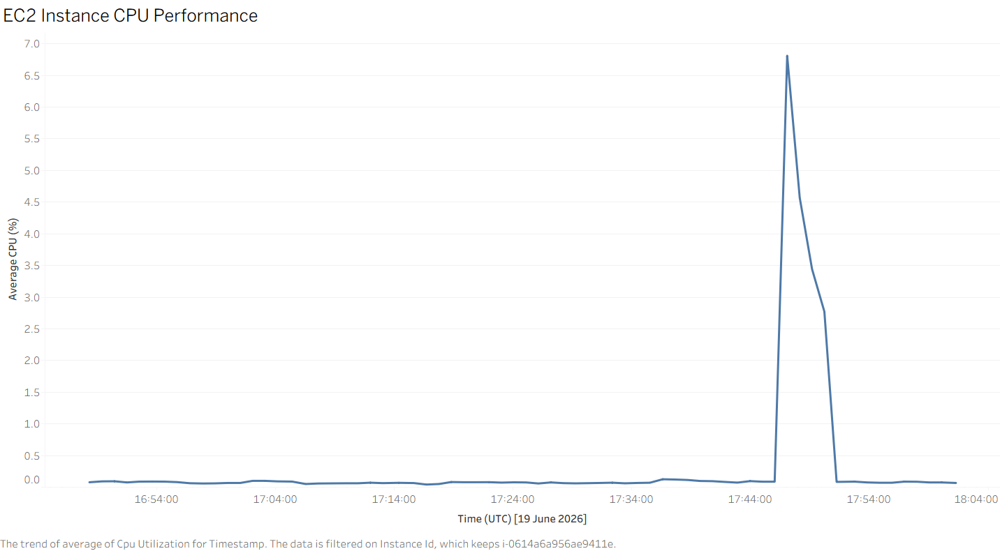

# AWS Cloud Infrastructure Monitor

A Python tool that provisions AWS cloud resources, monitors their health and performance in real time, and logs every metric to a local database for analysis and reporting.

---

## What it does

- **Provisions infrastructure** — spins up an EC2 instance, security group, and S3 bucket using the AWS SDK (Boto3)
- **Monitors performance** — polls CloudWatch every 60 seconds for CPU utilisation, network I/O, and instance health status
- **Logs metrics** — persists every reading to a SQLite database with a timestamp, building a historical record
- **Reports & alerts** — summarises average/peak CPU usage, flags threshold breaches, and exports data to CSV for analysis in Excel or Tableau
- **Runs automatically** — containerised with Docker and scheduled via GitHub Actions to run hourly without manual intervention

---

## Architecture

```
┌──────────────┐     ┌───────────────┐     ┌──────────────┐
│  provisioner │ --> │  AWS (EC2,    │ --> │  monitor.py  │
│     .py      │     │  S3, CloudWatch)│   │  (polls every│
└──────────────┘     └───────────────┘     │   60s)       │
                                            └──────┬───────┘
                                                    │
                                                    ▼
                                            ┌──────────────┐
                                            │  logger.py   │
                                            │  (SQLite DB) │
                                            └──────┬───────┘
                                                    │
                                                    ▼
                                            ┌──────────────┐
                                            │ reporter.py  │
                                            │ (summary,    │
                                            │  alerts, CSV)│
                                            └──────────────┘
```

The pipeline is containerised (Docker) and scheduled via GitHub Actions, running without manual intervention once deployed.

---

## Tech Stack

| Category | Tools |
|---|---|
| Language | Python 3.11 |
| Cloud SDK | Boto3 (AWS) |
| Cloud Services | EC2, S3, CloudWatch |
| Database | SQLite |
| Containerisation | Docker |
| CI/CD | GitHub Actions |
| Testing | pytest |

---

## Project Structure

```
aws-cloud-infrastructure-monitor/
├── src/
│   ├── provisioner.py       # Creates EC2 instance, S3 bucket, security group
│   ├── monitor.py           # Polls CloudWatch for live metrics
│   ├── logger.py            # Writes metrics to SQLite
│   └── reporter.py          # Summarises, alerts, exports CSV
├── config/
│   └── config.py            # Centralised settings (region, instance type, etc.)
├── sql/
│   └── schema.sql           # Database schema and reference queries
├── tests/
│   └── test_monitor.py      # Unit tests for logging and reporting
├── .github/workflows/
│   └── monitor.yml          # Scheduled hourly monitoring via GitHub Actions
├── main.py                  # CLI entry point
├── Dockerfile
├── requirements.txt
└── .env.example
```

---

## Setup

### Prerequisites
- Python 3.11+
- An AWS account (free tier is sufficient)
- AWS CLI installed and configured (`aws configure`)
- Docker (optional, for containerised runs)

### Installation

```bash
git clone https://github.com/Anthony4pf/aws-cloud-infrastructure-monitor.git
cd aws-cloud-infrastructure-monitor

# Create and activate a virtual environment
python -m venv venv
source venv/Scripts/activate  # (On Windows Git Bash)
# source venv/bin/activate    # (On Linux/Mac)

pip install -r requirements.txt
cp .env.example .env
```

Fill in your AWS credentials in `.env`, then:

```bash
python main.py provision   # creates EC2 instance + S3 bucket
python main.py monitor     # starts the monitoring loop
python main.py report      # prints summary + exports CSV
python main.py teardown    # terminates the EC2 instance when done
```

### Running with Docker

```bash
docker build -t cloud-monitor .
docker run --env-file .env cloud-monitor
```

### Running Tests

```bash
python -m pytest tests/
```

---

## Example Output

```
[2026-06-21T14:32:00+00:00] CPU: 12.4% | Net In: 204800.0B | Net Out: 102400.0B | Status: ok

==================================================
  Infrastructure Monitor — Summary Report
  Instance: i-0abc123def456
==================================================
  Total readings     : 48
  Average CPU        : 14.2%
  Peak CPU           : 38.7%
  Min CPU            : 3.1%
  First reading      : 2026-06-21T10:00:00+00:00
  Last reading       : 2026-06-21T22:00:00+00:00
==================================================
```

---

## Data Visualization


## Notes

- The free tier on AWS covers EC2 `t2.micro` instances and S3 storage within usage limits — running this project should not incur charges if you remember to run `teardown` when finished.
- CloudWatch metrics can take a few minutes to populate after an instance launches; if `monitor.py` returns `None` for early readings, this is expected.
